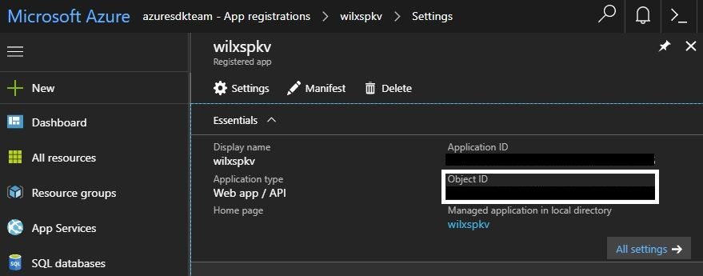

# Deploy Certificates to VMs from customer-managed Key Vault in Node

This sample explains how you can create a VM in Nodejs, with certificates installed automatically 
from a Key Vault account.

## This sample shows how to do the following operations of Key Vault certificate with Key Vault SDK
- Create resource group
- Create a key vault by the Key Vault Management Client
- Create the certificate
- Get the creation operation associated with a specified certificate
- Get certificate as secret
- Delete resource group

## Use latest Key Vault SDK

The Key Vault certificates SDK in this repo is **@azure/keyvault-certificates**. It's strongly recommended that you use the [latest](https://www.npmjs.com/package/@azure/keyvault-certificates) version of the key vault SDK package, please refer to the following examples:

 * [helloworld.ts](https://github.com/Azure/azure-sdk-for-js/blob/master/sdk/keyvault/keyvault-certificates/samples/typescript/src/helloWorld.ts) - Examples for common Key Vault certificate tasks:

     * Create the certificate
     * Get the certificate from a specific version
     * Update the certificate
     * Update the policy of the certificate
     * Delete the certificate

 * [operations.ts](https://github.com/Azure/azure-sdk-for-js/blob/master/sdk/keyvault/keyvault-certificates/samples/typescript/src/operations.ts) - Examples for Key Vault certificate's operation tasks:

     * Create a new certificate
     * Get the creation operation associated with a specified certificate
     * Delete the creation operation for a specified certificate that is in the process of being created
     * Get the certificate

 The Key Vault keys SDK in this repo is **@azure/keyvault-keys**. It's strongly recommended that you use the [latest](https://www.npmjs.com/package/@azure/keyvault-keys) version of the key vault SDK package, please refer to the following examples:

 * [helloworld.ts](https://github.com/Azure/azure-sdk-for-js/blob/master/sdk/keyvault/keyvault-keys/samples/typescript/src/helloWorld.ts) - Examples for common Key Vault key tasks:

     * Create a new elliptic curve key in Azure Key Vault
     * Create a new RSA key in Azure Key Vault
     * Get a specified key
     * List the keys
     * Update the key
     * Delete the key

 The Key Vault keys SDK in this repo is **@azure/keyvault-secrets**. It's strongly recommended that you use the [latest](https://www.npmjs.com/package/@azure/keyvault-secrets) version of the key vault SDK package, please refer to the following examples:

 * [helloworld.ts](https://github.com/Azure/azure-sdk-for-js/blob/master/sdk/keyvault/keyvault-secrets/samples/typescript/src/helloWorld.ts) - Examples for common Key Vault secret tasks:

     * Create a new secret
     * Get the secret
     * Update the secret with different attributes
     * Delete the secret

## Getting Started

### Prerequisites

- An Azure subscription

- A Service Principal. Create an Azure service principal either through
[Azure CLI](https://azure.microsoft.com/documentation/articles/resource-group-authenticate-service-principal-cli/),
[PowerShell](https://azure.microsoft.com/documentation/articles/resource-group-authenticate-service-principal/)
or [the portal](https://azure.microsoft.com/documentation/articles/resource-group-create-service-principal-portal/).

### Installation

1.  If you don't already have it, [get node.js](https://nodejs.org).

1.  Clone the repository.

    ```
    git clone https://github.com/Azure-Samples/key-vault-node-deploy-certificates-to-vm.git
    ```

2.  Install the dependencies using pip.

    ```
    cd key-vault-node-deploy-certificates-to-vm
    npm install
    ```

1. Export these environment variables into your current shell or update the credentials in the example file.

    ```
    export AZURE_TENANT_ID={your tenant id}
    export AZURE_CLIENT_ID={your client id}
    export AZURE_CLIENT_SECRET={your client secret}
    export AZURE_SUBSCRIPTION_ID={your subscription id}
    ```

    Optional, but recommended; this sample will attempt to obtain through graph if not provided:
    ```
    export AZURE_OBJECT_ID={your object id},
    ```
    you can access the object_id through portal by navigating to your service principal.
    

    > [AZURE.NOTE] On Windows, use `set` instead of `export`.

1. Run the sample.

    ```
    node index.js
    ```

## Demo

### Preliminary operations

This example setup some preliminary components that are no the topic of this sample and do not differ
from regular scenarios:

- A Resource Group
- A Virtual Network
- A Subnet
- A Public IP
- A Network Interface

For details about creation of these components, you can refer to the generic sample:

- [Managing VMs](https://github.com/Azure-Samples/compute-node-manage-vm)

### Creating a KeyVault account enabled for deployment

```javascript
    let keyVaultParameters = {
      location: location,
      tenantId: domain,
      properties: {
        sku: {
          family: "A",
          name: 'standard',
        },
        accessPolicies: [
          {
            tenantId: domain,
            objectId: objectId,
            permissions: {
              certificates: ['all'],
              secrets: ['all']
            }
          }
        ],
        # Critical to allow the VM to download certificates later
        enabledForDeployment: true,
        tenantId: domain
      },
      tags: {}
    };
    return await keyVaultManagementClient.vaults.beginCreateOrUpdateAndWait(resourceGroupName, keyVaultName, keyVaultParameters);
```

You can also found different example on how to create a Key Vault account:

  - From Node SDK: https://github.com/Azure-Samples/key-vault-node-getting-started

> In order to execute this sample, your Key Vault account MUST have the "enabled-for-deployment" special permission.
  The EnabledForDeployment flag explicitly gives Azure (Microsoft.Compute resource provider) permission to use the certificates stored as secrets for this deployment. 

> Note that access policy takes an *object_id*, not a client_id as parameter. This sample provides a quick way to convert a Service Principal client_id to an object_id using the `azure-graphrbac` client, provided the service principal used has the permission to view information on Microsoft Graph; this can be done by navigating to the service-principal => Settings => Required Permissions => Add (Microsoft Graph). Alternatively, simply set the `AZURE_OBJECT_ID` environment variable ([see above](https://github.com/Azure-Samples/key-vault-node-deploy-certificates-to-vm#installation)).


### Ask Key Vault to create a certificate for you

```javascript
      const createPoller = await certificateClient.beginCreateCertificate(
        certificateName,
        certificatePolicy
      );
      await createPoller.pollUntilDone();
```

A default `certificatePolicy` is described in the sample file:
```javascript
      let certificatePolicy = {
        exportable: true,
        keyType: "RSA",
        keySize: 2048,
        reuseKey: true,
        contentType: "application/x-pkcs12",
        issuerName: "Self",
        subject: "CN=CLIGetDefaultPolicy",
        validityInMonths: 12,
        keyUsage: [
          "cRLSign",
          "dataEncipherment",
          "digitalSignature",
          "keyEncipherment",
          "keyAgreement",
          "keyCertSign",
        ],
        lifetimeActions: [
          {
            action: "AutoRenew",
            lifetimePercentage: 90,
          },
        ],
      };
```

This is the same policy that:

- Is pre-configured in the Portal when you choose "Generate" in the Certificates tab
- You get when you use the CLI 2.0: `az keyvault certificate get-default-policy`

> Create certificate is an async operation. This sample provides a simple polling mechanism example.

### Create a VM with Certificates from Key Vault

First, get your certificate as a Secret object:

```javascript
    await certificateClient.getCertificate(certificateName)
```

During the creation of the VM, use the `secrets` atribute to assign your certificate:.

```javascript
  let vmParameters = {
    location: location,
    osProfile: {
      computerName: vmName,
      adminUsername: adminUsername,
      adminPassword: adminPassword,
      // Key Vault Critical part
      secrets: [{
        sourceVault: {
            id: vaultObj.id,
        },
        vaultCertificates: [{
            certificateUrl: certificateSecretObj.secretId
        }]
    }]
    },
    hardwareProfile: {
      vmSize: 'Standard_D2s_v3'
    },
    storageProfile: {
      imageReference: {
        publisher: publisher,
        offer: offer,
        sku: sku,
        version: "latest"
      }
    },
    networkProfile: {
      networkInterfaces: [
        {
          id: nicId,
          primary: true
        }
      ]
    }
  };

  return await computeClient.virtualMachines.beginCreateOrUpdateAndWait(resourceGroupName, vmName, vmParameters);
```
> [AZURE.NOTE] By default, this sample deletes the resources created in the sample. To retain them, comment out the line: `return resourceClient.resourceGroups.deleteMethod(resourceGroupName);`

## Resources

- https://azure.microsoft.com/services/key-vault/
- https://github.com/Azure/azure-sdk-for-node
- https://docs.microsoft.com/node/api/overview/azure/key-vault
